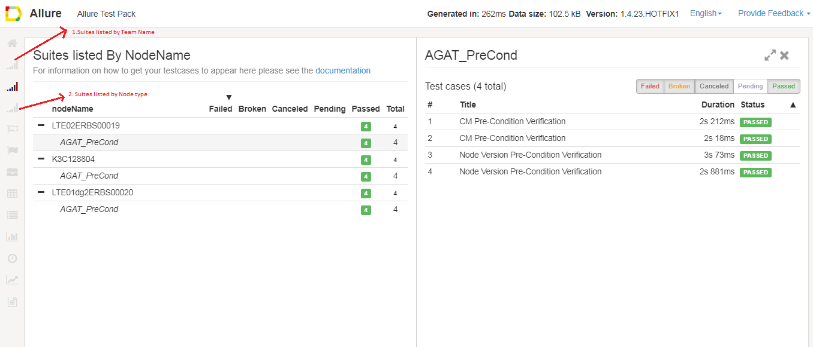

<head>
    <title>Allure NodeType/TeamName/NodeName plugins</title>
</head>

# Introduction
The document describes how to use both the nodeType,teamName and nodeName plugins, and the requirements needed in testware.

# Allure NodeType/TeamName/NodeName plugin

## Requirements
<!-- Testing E2C FEM -->
To use either of the plugin's and have your test cases listed by nodeType/teamName/nodeName, you will need to do the following:

- Your Scenarios must be of type dataDrivenScenario
    - 	https://taf.seli.wh.rnd.internal.ericsson.com/userdocs/Latest/taf_concepts/taf_scenarios/manipulating_data.html
        - scroll to Data Driven Scenarios
- Your Csv must contain the following column
    - Column header = "nodeType" for NodeType plugin. Column header = "teamName" for TeamName plugin
    - Column header = "networkElementId" for NodeName plugin.
    - Each testcase (line in csv) must contain the nodeType/teamName or networkElementId(for nodeName plugin).
    - your dataDrivenScenario does not need to use this value in your test but it must be present in the data

## Allure report:

The allure report below shows the testcases by nodeName:

1. click on the icon highlighted above to view the testcases by nodeType or nodeName. (this is similar to the way the teamName plugin works as well)

# References
- Infrastructure ticket [CIS-51526](https://jira-nam.lmera.ericsson.se/browse/CIS-51526)
- Infrastructure ticket [TORF-336977](https://jira-oss.seli.wh.rnd.internal.ericsson.com/browse/TORF-336977)
