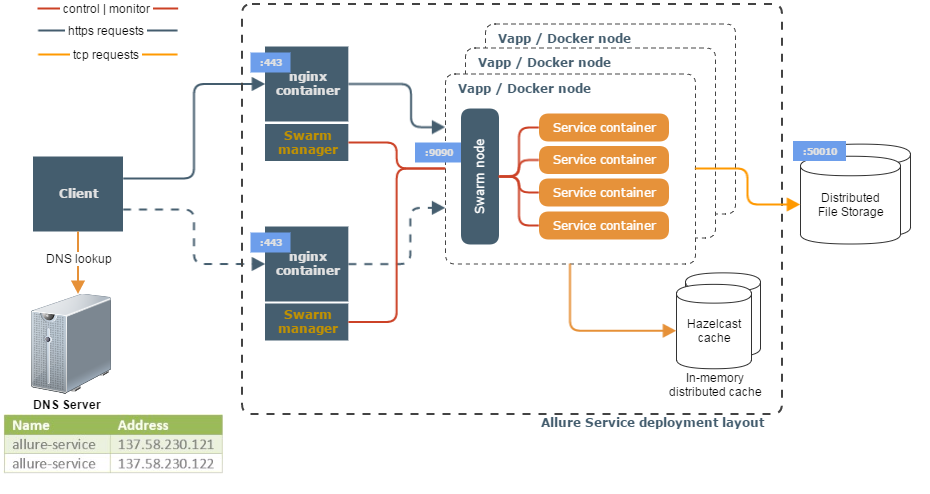

<head>
    <title>Allure Service Architecture</title>
</head>

# Introduction
The document describes and suggests a proposed architecture design, i.e. document has illustrations of high level  architecture diagrams, including software components, their interaction and deployed infrastructure.

# Allure Service Architecture
## Scopes and boundaries
Defining the architectural road map, by defining standards to ensure consistent and maintainable code. One of [CIP-18844](https://jira-nam.lmera.ericsson.se/browse/CIP-18844) requirements is being based on [Microservices](http://www.martinfowler.com/articles/microservices.html) approach. It means that every reusable service is deployed separately. Components are interchangeable and have well-defined APIs.

Non-functional concerns:
- Scalability
- Deployment
- Microservices

## Communication
The architecture of the Allure Service is based on the following protocol and serialization payload format:

Communication Transport Protocols: 
- HTTP/HTTPS
- TCP/IP

Data serialization methods: 
- JSON
- ZIP
- HTML

## Target Architecture Diagram
The following diagram illustrates conceptual approach to `Microservice` architecture of Allure Service.


### ClientClient
Client application like TAF Scheduler or maven plugin which communicates with report service API fronted by nginx reverse proxy. The client perform domain name lookup in round-robin DNS server.

### DNS Server
The DNS server has allure-service DNS name which is mapped to two IP addresses of L4 reverse-proxy nginx servers. The DNS server return IP address on round-robin algorithm with TTL checks for fault tolerance in case if one nginx node goes down. See [erikube ingress example](https://gerrit.ericsson.se/plugins/gitiles/erikube/erikube/+/master/erikube-ingress/) in more details.

### Nginx Container
Nginx is automatically deployed as one or two nodes to serve and load balance HTTPS requests to service swarm manager with its internal swarm node balancer which then redirect them to the certain service container.

### Vapp / Docker node
This is virtual machine with installed docker daemon and swarm node mode to allow to control and manage its containers, e.g. deployment and scalability.

### Service Container
The docker container of build Allure Reporting Service image. Deployed automatically.

### Distributed File Storage
One of multiple solutions to store temporary uploaded files (allure XML results and reports) in distributed file system. Could be network mapped directory (Linux/Unix NFS or LUN).

### Hazelcast Cache
Distributive cache to make exclusive lock on scheduled job for completed and uncompleted Allure report files clean up.

## Allure Service
### Package structure
- api - package `com.ericsson.de.allure.service.api.resource`. Responsible for interaction with Allure service using its API. Deployed as single unit. 
- core - package `com.ericsson.de.allure.service`. Responsible for implementation of Allure service API.

## Maven Artifact Coordinates
The following maven artifacts coordinates are proposed to use in service development.

### Service API
```
<groupId>com.ericsson.de</groupId>
<artifactId>allure-service-api</artifactId>
```

### Service Core
```
<groupId>com.ericsson.de</groupId>
<artifactId>allure-service-core</artifactId>
```

# References
- [Erikube ingress example](https://gerrit.ericsson.se/plugins/gitiles/erikube/erikube/+/master/erikube-ingress/) of dynamic DNS configuration
- Infrastructure ticket [CIS-45481](https://jira-nam.lmera.ericsson.se/browse/CIS-45481)
