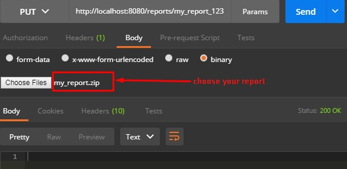
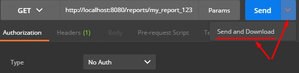
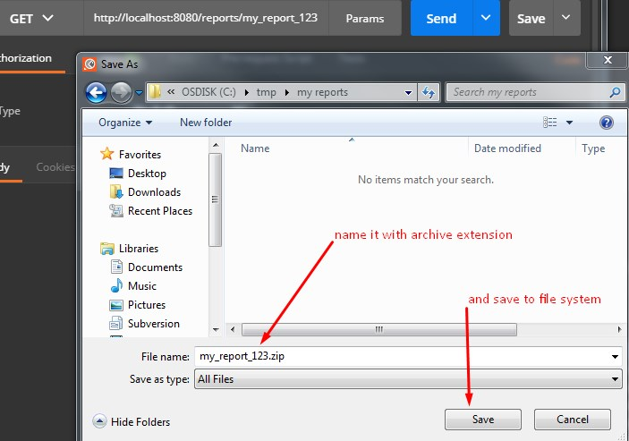
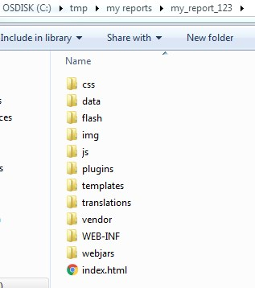
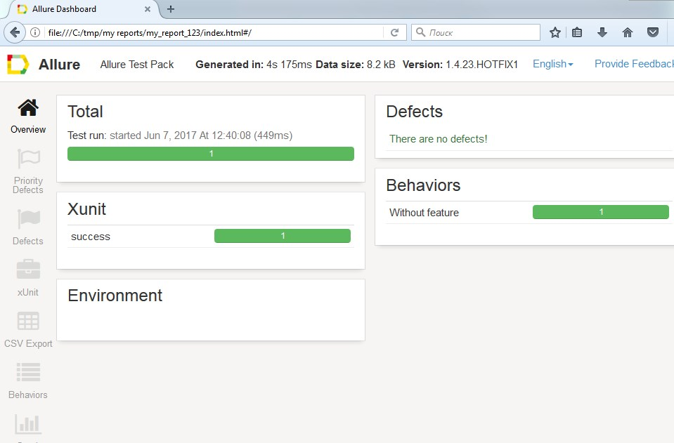
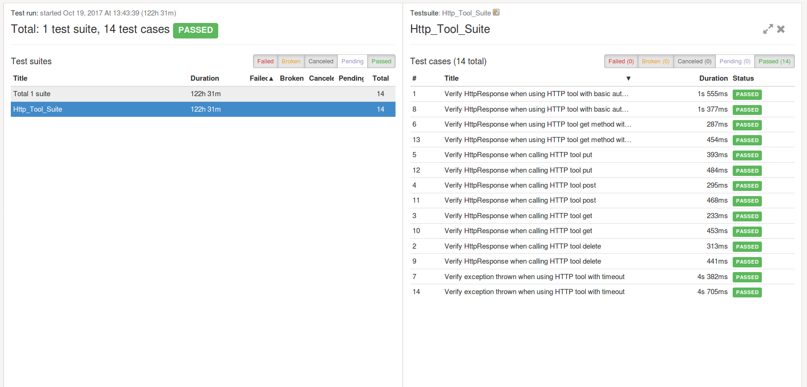
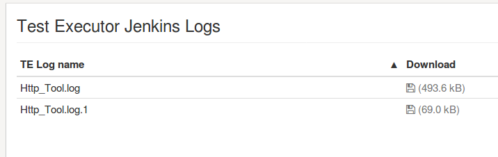
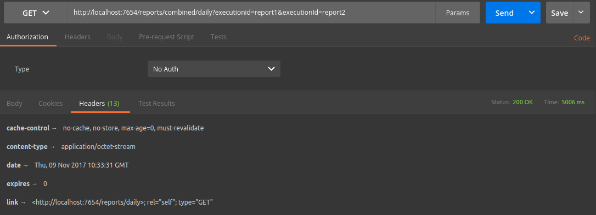

<head>
    <title>Allure Service REST API</title>
</head>

# REST API
The Rest API of Allure Service contains the following resources:

- Root resource;
- Report resource;
- Combined resource;

All resources are designed by using the [RAML tool](https://confluence-nam.lmera.ericsson.se/display/TAF/REST+API+Designer+tools) 

## Root API
The information about the deployed service is available at `/api` root resource. Here is the corresponding request and response:

```
HTTP GET /api
{
    "version": "1.0.0-SNAPSHOT",
    "name": "Allure Report Service Core",
    "groupId": "com.ericsson.de",
    "artifactId": "allure-service-core",
    "buildDate": "2017-08-17 14:32"
}
```

## Report resource

### Introduction
The `/report` API allows you to upload multiple XML results to generate final Allure report. 

### Upload XML result to create Allure report
The following illustration shows how to submit XML results for the final report using the [Postman](https://www.getpostman.com/) client tool.

- first, archive all XML results and attachments in ZIP format, i.e. `my_report.zip`: 
    
    ```
    2e376a7d-04e5-40a5-bbb3-b83143a39d09-attachment.txt
    32ad9685-cce5-4d0b-ac29-92a070ea4e3b-attachment.txt
    3d1f8e20-df68-48f0-adde-b9fd786dfd13-testsuite.xml
    4943166a-6d9a-4dbe-9836-44188d04f75f-attachment.txt
    572f55b8-ba29-4c67-a83f-ace9f65f29d3-attachment.txt
    fcb4ccf3-5e5f-4fc1-b682-4b27512e28a1-attachment.txt
    ```
    
- second, create unique report name/ID (e.g. `my_report_123`) which will be used to upload binary archive and later retrieve final Allure report of it.
- third, go to Headers section and add "Content-Type" key and value as "application/octect-stream" 
- last, submit the request by pressing button 'Send'.



The response of `200` status code indicates the request has been successfully handled.

### Retrieve Allure report

The final Allure report can be retrieved by unique ID used in previous case of XML results uploads.

The following illustration shows how to retrieve Allure report using [Postman](https://www.getpostman.com/) client tool:



Once `Send and Download` button has been pressed, Allure service returns back binary file which needs to be persisted in file system with archive extension:



The following illustration shows extracted content of received allure report archive: 



Here is how allure report looks like if open `index.html` file in browser, e.g. `Firefox`:



## Combined Resource
The `/reports/combined` API allows you to generate an allure report from multiple executions.

### Generate a combined report

The name of the combined report is the resource and the results to combine are given as query parameters.

Example:

```
/reports/combined/dailyReport?executionId=330b03d3-4d45-4eab-b91b-ffbf9d9275ea&executionId=a6f4a2f3-f468-4c7f-8e58-c4d31f742901
```

The query parameters are the unique ids of each of the individual executions that you want to combine into a single report.

### What if the same suite is in multiple executions?

All the testcases will be present under a single suite in the report.



And the Jenkins Logs will be separated on the Jenkins Logs tab.



## Clean-up policy
There are two types of reports - completed and uncompleted reports. 

A completed report is a report which is already generated from the uploaded XML results once the service receives a `GET` request from the user.

Un uncompleted report is a report which is not yet generated, i.e. the user still could upload XML results and there was not any `GET` requests to 
retrieve Allure report.

By default a completed report is cleaned up in one hour. An uncompleted one is cleaned up in 24 hours.
This is configurable on service start-up, please see [installation page](installation.html) for more information.  

## Links

The Allure Service REST API implements [HATEOAS](https://en.wikipedia.org/wiki/HATEOAS) from the [REST Architectural Style](https://www.ics.uci.edu/~fielding/pubs/dissertation/top.htm)

This means when you execute requests, the response header will contain link(s) to where you can go next.

For example when you generate a combined report, the response header will contain a link to the generated report so that you can retrieve it without
 re-generating it.


